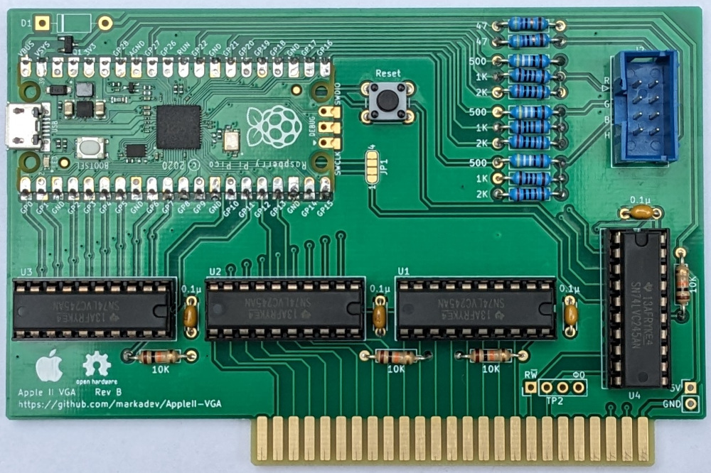
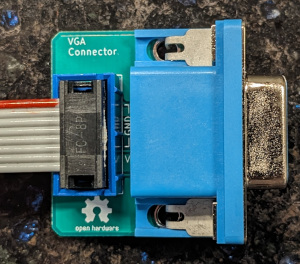

# Notes on building a VGA card

Before building a card you will need to make a decision on how you want the VGA connector to be mounted:

1. You could build a connector board, which works well for an Apple IIe but will block a IIe slot where it's mounted.
2. You could build a custom cable from the pin header to a shrouded DB-15HD connector that comes out the back.
   This could work for both Apple II+ and Apple IIe's.
3. You could build something else! Maybe you want to pipe the output directly into a VGA -> HDMI converter?

In the parts lists I included specific part numbers when it matters and also included the exact
[Mouser](https://www.mouser.com/) part numbers for all the parts I used. You do not need to buy from Mouser but you
can use their part database as a reference to find compatible parts from your supplier.

You should also check the schematics for any special part notes that I might have missed here.

## Getting parts

### Main board

Check the [BOM](../AppleVGA/AppleVGA_BOM.csv) for the main board. Important notes about parts (also check the
schematic for notes):

 * The DAC resistors R4-R12 should ideally be 1% tolerance but it's not a strict requirement
 * Only one of D1 or Q1 need to be installed so you only need to buy one of them (_they are both inexpensive
   parts so you could buy both and decide later!_)
   * If you want to avoid tiny surface mount parts then choose D1
   * If you can't find one of them in stock then pick the one you can find in stock
   * Otherwise prefer to install Q1
 * I recommend also getting 4 [20-pin DIP IC sockets](https://www.mouser.com/ProductDetail/571-1-2199298-6) for the ICs
 * It's your choice whether to surface mount the Pico or to use an additional set of 1x20 pin headers. Both will work
   without obstructing access to the Pico's USB port for firmware updates.
 * You can use the less expensive break-apart 2x4 pin headers for J2
 * The 'Reset' button is optional and mainly just helps me during firmware development.

### VGA connector board

Check the [BOM](../AppleVGA-Connector/AppleVGA-Connector_BOM.csv) for the connector board. If you need to
substitute the DB-15HD connector then double-check that the footprint of the replacement part is the same as
the original. The datasheet for the original part will be linked from Mouser's part page.

You will also need a ribbon cable to connect to the main board which can be made with:
 * 2 * [2x4 wire housings](https://www.mouser.com/ProductDetail/710-61200823021)
 * about 6 inches of 8 conductor ribbon cable

### VGA connector cable

If you want to build a custom cable instead of the connector board then it can be done with a few parts
and using the [connector board schematic](../AppleVGA-Connector/AppleVGA-Connector.pdf) as a wiring guide.

Parts:
 * A "Dupont" wire crimper kit [something like this](https://www.amazon.com/gp/product/B07VQ6YNSC)
 * Either 2 1x4 housings or 1 2x4 housing
 * A DB15-HD female connector (solder-bucket connection is easiest to use)
 * A DB-9 shroud [like this](https://www.mouser.com/ProductDetail/601-40-9709H)
 * A bit of 8 conductor cable, as long as you need. Scrap ethernet cable works OK.

## Getting a PCB

You can use the gerber files for the boards to get a PCB made at any PCB manufacturer you'd like. You usually
just zip up the whole directory and upload it to their site for processing. Take care to understand the
manufacturer's requirements for the edge connector though even the cheap PCB makers have automated design checks
to validate the PCB is compatible.

 * Gerber files for the main PCB: [here](../AppleVGA/outputs)
 * Gerber files for the connector PCB: [here](../AppleVGA-Connector/outputs)

For my board I used JLCPCB with excellent results. The gold-plated edge connector came out great and it was
not too expensive. I changed a few settings from their default settings:

 * PCB thickness: 1.2mm
 * Surface Finish: ENIG
 * Remove Order Number: Specify a location
 * Gold Fingers: yes
 * 30° finger chamfered: yes

You could exclude the gold plating and higher quality surface finish to reduce the cost. A standard PCB thickness
is 1.6mm but I found 1.6mm cards to be hard to get into my IIe's expansion slots and flexed my mainboard a lot during
insertion so I reduced to 1.2mm and have not had any issues.

## Assembling the board

You can assemble the board using a general assembly guideline of installing the lowest profile components first:

1. the Q1 surface-mount MOSFET (if using the MOSFET)
2. resistors
3. low-profile inline capacitors (if you have them)
4. the D1 diode (if not using the MOSFET)
5. IC sockets
6. Reset button (optional)
7. tall capacitors (if you have them)
8. Pico pin headers
9. VGA IDC connector or pin header. Ensure that pin 1 of the connector housing is aligned with pin 1 on the PCB
   so that the polarity notch is facing inward.

If you're surface mounting the Pico then it can be done last.

If you're building a connector board too then just solder it up, ensuring the IDC connector is oriented correctly.

## Installing the Pico firmware

To install firmware on the Pico you'll need a USB to micro-USB cable.

1. Download a firmware file for your Apple model (II+ or IIe)
   [from the release page](https://github.com/markadev/AppleII-VGA/releases)
2. Hold the Pico's button down while connecting the Pico's USB to a PC
3. Your OS will detect a virtual USB-attached disk
4. Drag and drop the (`.uf2`) firmware file onto the virtual USB drive 
5. The Pico will install the firmware and then reboot

## Power-up test

To perform a simple test of the VGA output circuitry:

1. Remove the board from any Apple II
2. Connect the VGA monitor
3. Connect the Pico's USB to a PC or USB charger
4. The board should be outputting an Apple II text screen full of inverse `@` characters
